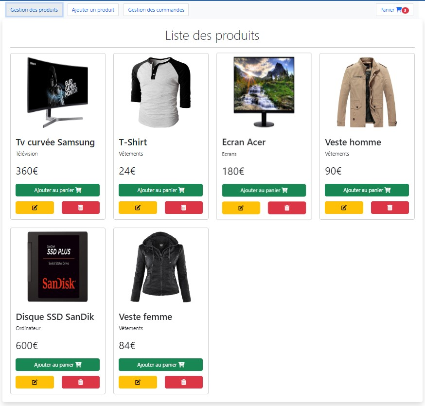
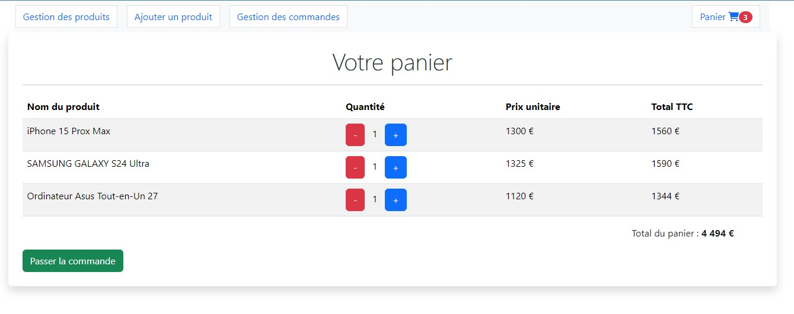
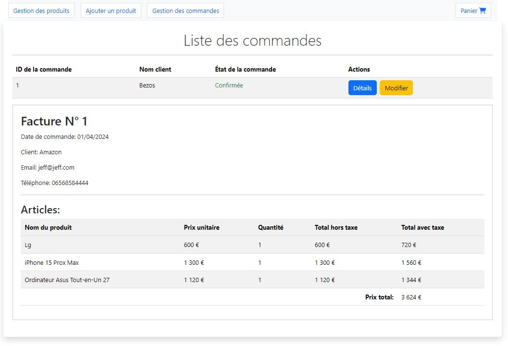
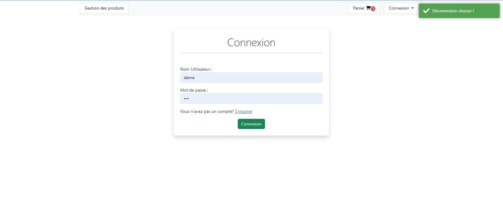

# Projet-ecommerce-spring-boot-angular-dame

This project is an e-commerce application built with Angular and Spring Boot.

```properties
# Backend Spring Boot

# Add application name
spring.application.name=e-commerce

# MySQL Configuration
spring.datasource.url=jdbc:mysql://localhost:3306/e-commerce?createDatabaseIfNotExist=true&useSSL=false&serverTimezone=UTC
spring.datasource.username=your_username_here
spring.datasource.password=your_password_here
spring.jpa.show-sql=true
spring.jpa.hibernate.ddl-auto=update
#spring.jpa.hibernate.ddl-auto=create
spring.main.allow-circular-references=true
```

## Frontend Angular

## Homepage



## Online store basket



## order management



## Logout page



```markdown
## Prerequisites

- Node.js
- Angular CLI
- Java Development Kit (JDK)
- Spring Boot
```

````markdown
## Getting Started

1. Clone the repository:

   git clone https://github.com/mboup1/e-commerce-spring-boot-angular.git

```markdown
## Development server

1. **Install Dependencies:**

   - Run `npm install` to install the project dependencies.

2. **Run `ng serve`:**
   - Execute `ng serve --open` to start a dev server and open the application in your default browser. The app will reload if you make any changes to the source files.
```
````

```markdown

```
